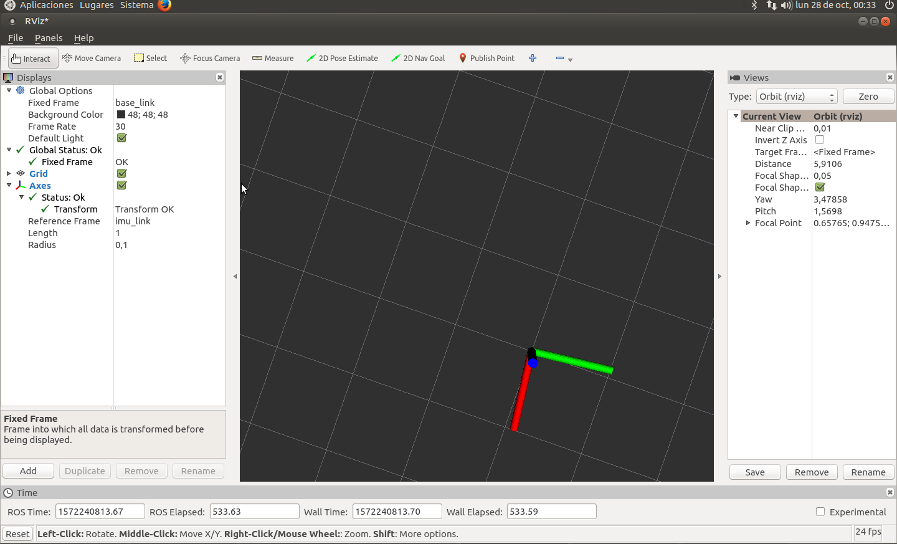

ROS MPU_GY85 Node
================

c++ ROS node wrapper for the gy-85 gyroscope / accelerometer.\
Reads accelerometer, gyroscopic and magnetic data in 3D giving 9 Degrees of Freedom.\
Publishes sensor_msgs::IMU to /imu/data_raw topic(angular_velocity and linear_acceleration).\
Publishes sensor_msgs::MagneticField to /imu/data_raw topic(angular_velocity and linear_acceleration).\
Supported interface : I2C.\
used in Jetson Nano

Installation
------------

First clone this repository into your ROS workspace(src folder):

    git clone https://github.com/ceoifung/mpu_gy85.git
    
Compile it:

    catkin_make --pkg mpu_gy85

Run a node:

	source devel/setup.bash
	rosrun mpu_gy85 mpu_gy85_node

Review the published data with:

    rostopic echo /imu/raw

Test App
--------------------

if you want to test the Gy85 sensor, you can run this command to complie an program

	cd src
	make
	./gy85.out

Complementary filter
--------------------

install imu-tools:

	sudo apt-get install ros-melodic-imu-tools

run launch file:

	source devel/setup.bash
	roslaunch mpu_gy85 imu.launch

reference: http://wiki.ros.org/imu_complementary_filter

Create a rosbag file (.bag)
---------------------------

run launch file:

	source devel/setup.bash
	roslaunch mpu_gy85 record_topic.launch

Get data from the topics of the .bag file:

	rostopic echo -b file.bag -p /topic

Visualize Rviz:
---------------

	source devel/setup.bash
	roslaunch mpu_gy85 gy85_rviz.launch

Configure as FIG.1 or load config file in (rviz_config/imu.rviz)

GIF:

